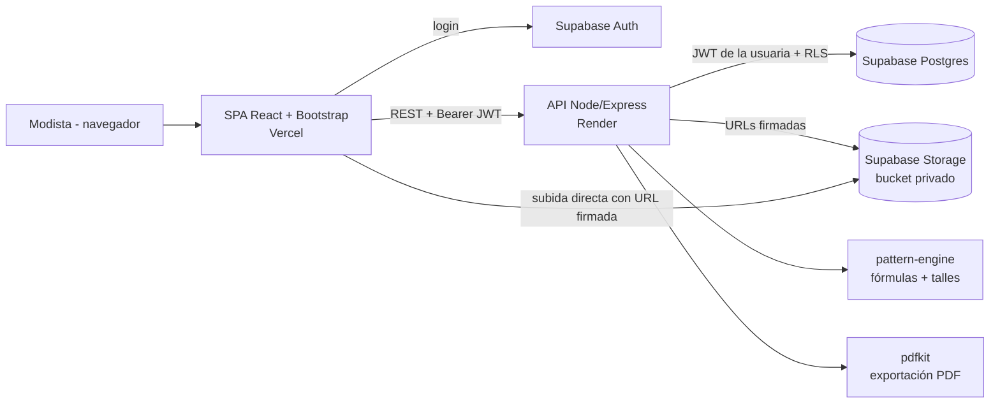
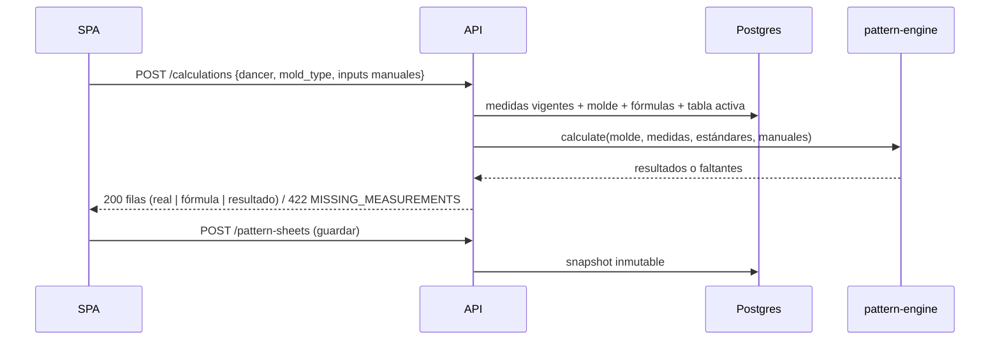
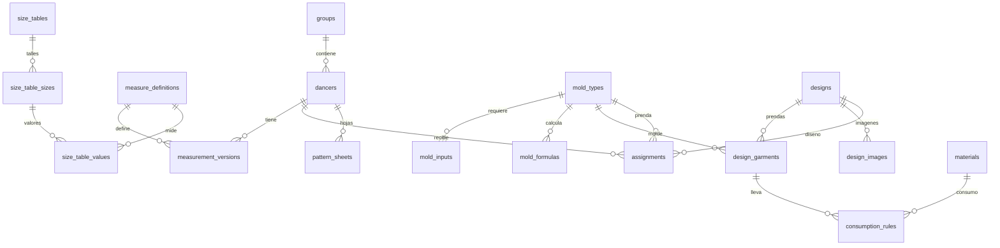

# Diseño — Hilanzapp

## Resumen

Hilanzapp se construye como un monorepo TypeScript con tres piezas: una **SPA React + Bootstrap** (Vercel), una **API REST en Node.js/Express** (Render) y **Supabase** (Postgres + Auth + Storage). La SPA solo habla con la API (usa `supabase-js` únicamente para el login); la API es la única puerta de acceso a los datos y reenvía el JWT de la usuaria a Supabase para que las políticas **RLS** apliquen como segunda barrera.

El corazón del sistema es un **motor de moldería puro** (`packages/pattern-engine`, sin I/O) que evalúa fórmulas guardadas como **datos** y no como código. Eso resuelve de una vez el Req 5 (fórmulas precargadas) y el Req 12 (fórmulas editables): las fórmulas del Req 5 son simplemente el contenido inicial de las tablas `mold_formulas`. Lo mismo vale para los talles: las tablas de Baúl de Moda son datos sembrados por usuaria y editables (Req 6 y 13).

Dos decisiones estructurales atraviesan todo:

1. **Medida real ≠ resultado calculado.** Las medidas viven en `measurement_versions` (versionadas, Req 10); los resultados nunca se escriben ahí. Los cálculos se hacen bajo demanda y solo se persisten como **hoja de molde con snapshot** (Req 5.7, 12.4).
2. **El talle sugerido se calcula al leer, no se guarda.** Solo se persisten los talles manuales. Así nunca queda desactualizado cuando cambia una medida, la edad o la tabla activa (Req 6, 13.4).

## Arquitectura



**Flujo de una hoja de molde (Req 4, 5):**



**Decisiones de plataforma:**

- **Autenticación (Req 8):** Supabase Auth con email + contraseña. Los registros públicos se **deshabilitan** en Supabase (es una única usuaria); el usuario se crea desde el panel. La API valida el JWT con `jose` contra el JWKS del proyecto (`{SUPABASE_URL}/auth/v1/.well-known/jwks.json`) y crea un cliente Supabase por request con ese token, de modo que RLS actúa.
- **Aislamiento de datos:** toda tabla lleva `owner_id uuid default auth.uid()` y una política `owner_id = auth.uid()`. Se denormaliza `owner_id` en tablas hijas para que las políticas sean triviales.
- **Datos precargados por usuaria:** las fórmulas, moldes, medidas base y tablas de talles se **copian a filas propias** de la usuaria la primera vez que entra (`POST /me/bootstrap`, idempotente). Cada fila lleva `template_key`. "Restaurar valores originales" (Req 12.6, 13.5) re-aplica la plantilla de `packages/seed-data`. No hay filas compartidas ni con `owner_id` nulo, así RLS no tiene excepciones.
- **Hosting:** Vercel sirve la SPA (rewrite a `index.html`); Render corre la API (`render.yaml`, build `tsc`, start `node dist`). CORS restringido al dominio de Vercel. El plan gratuito de Render duerme el servicio; ver Riesgos.
- **Stack de la SPA:** React 18 + Vite, React Router, `react-bootstrap` sobre Bootstrap 5, TanStack Query (caché y reintentos), `react-hook-form` + `zod`. Diseño *mobile-first* (la toma de medidas se hace con celular o tablet en mano).

## Estructura del repositorio

```
Hilanzapp/
├─ apps/
│  ├─ api/            # Express: routes → services → repositories
│  └─ web/            # React + Vite + react-bootstrap
├─ packages/
│  ├─ pattern-engine/ # Evaluador de fórmulas + sugerencia de talle (puro, sin I/O)
│  └─ seed-data/      # Plantillas JSON: medidas, moldes, fórmulas, tablas de talles
├─ supabase/
│  ├─ migrations/     # SQL: esquema, RLS, funciones, storage
│  └─ config.toml
├─ specs/hilanzapp-mvp/  # requirements.md, design.md, tasks.md
├─ render.yaml
└─ .github/workflows/ci.yml
```

Capas de la API: **routes** (validación con `zod`, HTTP) → **services** (reglas de negocio, orquestación) → **repositories** (única capa que habla con Supabase). El motor se llama desde *services*, nunca desde *routes*.

## Componentes y responsabilidades

### `packages/pattern-engine` (nuevo)

Módulo puro, testeable sin base de datos. Usa `decimal.js` para no arrastrar errores de punto flotante (÷ 3,14, × 0,15, × 2/3).

| Función | Responsabilidad | Req |
|---|---|---|
| `calculateMold(mold, ctx)` | Resuelve inputs (medida, estándar, manual, opción) y evalúa las fórmulas en orden topológico. Devuelve filas `{key, label, section, realValue?, formula, result}` o la lista de faltantes. | 5, 12 |
| `validateFormulaSet(mold, measureKeys)` | Detecta referencias inexistentes, ciclos y divisor cero antes de guardar. | 12.5 |
| `suggestSize(table, measures, priority)` | Asigna talle por medida y resuelve el final según la prioridad de la prenda. Devuelve el desglose. | 6 |
| `interpolateTable(low, high, sizes, opts)` | Genera los talles intermedios (adolescentes). Se usa al **construir** las semillas, no en runtime. | 6.2 |
| `aggregateProduction(assignments)` | Cuenta por prenda + talle efectivo y lista nombres. | 7 |

**Modelo de fórmula** (dato, no código): `label`, `section`, `operand_a` (referencia a un input o a una fórmula anterior del mismo molde), `op` ∈ `direct | div | mul | add | sub`, `operand_b` (constante decimal, fracción `"2/3"` o referencia), `adjustment_cm` (default 0), `decimals` (default 1). Con eso se expresan todas las fórmulas del Req 5:

- `1/4 pecho` = `pecho div 4`
- `Ancho de tiro delantero` = `cuarto_cadera mul 0,15` (referencia a otra fórmula)
- `Ancho de tiro trasero` = `ancho_tiro_delantero mul 3`
- `Alto del rectángulo de manga` = `sisa mul 2/3`
- `Radio 1/2 campana` = `bajo_busto div 3,14`; los divisores 3,14 / 6,28 / 12,56 son los del método de la modista, no `Math.PI`.
- `Largo de falda del vestido` = `largo_hombro_rodilla sub largo_canesu`
- `Con ajuste`: `pecho div 4` + `adjustment_cm = 0,5` cubre el ejemplo "Pecho ÷ 4 + 0,5 cm" (Req 12.2).

**Tipos de input de un molde:** `measure` (medida corporal vigente), `standard` (valor de la tabla de talles, p. ej. altura de cadera), `manual` (dato ingresado durante la construcción, p. ej. *sisa dibujada*, *largo de canesú*; Req 4.4) y `choice` (opción con valor numérico, p. ej. tipo de vuelo con divisor 3,14 / 6,28 / 12,56; Req 4.5).

**Sugerencia de talle (Req 6):** para cada medida (pecho, cintura, cadera) se elige el talle **más cercano** de la tabla, con empate hacia el talle mayor; si la medida queda fuera del rango de la tabla se devuelve el talle extremo con `out_of_range: true`. El talle final sale de la medida prioritaria del molde: `size_priority` = `pecho` (cuerpo base, manga, vestido/remera), `cadera` (falda, pantalón) o `both` (vestido con canesú: se devuelven los dos desgloses y no se fuerza un talle único; Req 6.4).

### `apps/api` (nuevo)

| Módulo | Contenido | Req |
|---|---|---|
| `middleware/auth` | Verifica JWT (JWKS), arma cliente Supabase por request. | 8 |
| `groups` | CRUD de grupos; borrado con confirmación explícita. | 1 |
| `dancers` | Ficha, mover de grupo, estado de medidas (ninguna/parcial/completa). | 2, 3.6 |
| `measurements` | Medidas base y personalizadas, versionado, historial, restauración, comparación entre tomas. | 3, 10 |
| `sizing` | Tabla activa por rango etario, sugerencia con desglose, talles manuales. | 6 |
| `molds` | Tipos de molde, inputs y fórmulas editables; restaurar; vista previa. | 4, 5, 12 |
| `calculations` | `POST /calculations` (sin persistir) y hojas de molde con snapshot. | 5 |
| `size-tables` | Ver/editar/duplicar/crear/restaurar tablas; activar. | 13 |
| `designs` | Diseño de vestuario, catálogos, medidas especiales, imágenes. | 9, 11 |
| `assignments` | Prenda asignada a bailarina (individual o masiva por grupo). | 4, 6.7, 11.4 |
| `production` | Resumen por prenda + talle, pendientes. | 7 |
| `exports` | PDF de hoja de molde, de resumen y lote (`pdfkit`). | 14 |
| `inventory` | Materiales, consumo por prenda/talle, costos, faltantes, descuento de stock, estadísticas. | 15 |

### `apps/web` (nuevo)

Rutas y pantallas (cada una traza a los requerimientos que cubre):

| Ruta | Pantalla | Req |
|---|---|---|
| `/login` | Inicio de sesión; redirige si no hay sesión. | 8.3 |
| `/` | Inicio: lista de grupos, "Nuevo grupo". | 1 |
| `/groups/:id` | Grupo: bailarinas con talle, estado de medidas y vestuario; alta/edición/borrado. | 1, 2, 3.6 |
| `/dancers/:id` | Ficha: datos generales, medidas (con "+ medida personalizada"), historial, sugerencia de talle con desglose, talles manuales y por prenda. | 2, 3, 6, 10 |
| `/designs`, `/designs/:id` | Diseños: características, prendas, medidas especiales, imágenes. | 9, 11 |
| `/dancers/:id/molds/:moldTypeId` | **Hoja de molde:** medida real y resultado lado a lado; campos manuales (sisa); guardar; PDF/imprimir. | 4, 5, 14 |
| `/groups/:id/production` | Producción por prenda + talle con lista de nombres, pendientes, PDF. | 7, 14 |
| `/settings/molds` | Editor de moldes y fórmulas con vista previa. | 12 |
| `/settings/size-tables` | Editor de tablas de talles, duplicar, activar, restaurar. | 13 |
| `/inventory` | Materiales, consumo, costos, faltantes, estadísticas. | 15 |

Vista de impresión: hojas con `@media print` (sin navegación, A4) reutilizando los mismos componentes que la pantalla (Req 14.3).

### `packages/seed-data` (nuevo)

JSON versionado en el repo: medidas base, 11 tipos de molde con sus fórmulas y opciones (cuerpo base, manga, pantalón, 7 faldas, vestido con canesú), catálogos de escote/manga/falda y las tablas de talles **Bebés, Niños, Adolescentes (interpolada) y Mujeres** de Baúl de Moda. Las fórmulas del Req 5 son los tests de oro del motor.

## Modelos de datos

Todas las tablas incluyen `id uuid pk`, `owner_id uuid not null default auth.uid()`, `created_at`, `updated_at`. Las medidas se guardan en `numeric(7,2)` (cm).



**Núcleo**

- `groups(name)`, `group_designs(group_id, design_id)`.
- `dancers(group_id fk, name, age int null, measured_on date null, manual_size_label text null, size_table_id fk null, notes)`. `size_table_id` permite forzar la tabla; si es nulo se usa la tabla activa del rango etario de la edad. (Req 1, 2, 6)
- **No** existe columna de talle sugerido: se calcula (ver Resumen).

**Medidas (Req 3, 10)**

- `measure_definitions(key, name, kind ('body'|'standard'), is_base bool, sort, unit default 'cm', template_key null)`. `kind='standard'` son valores que solo existen en tablas de talles (`altura_cadera`, `altura_tiro`). Una medida personalizada es una definición con `is_base=false`, reutilizable entre bailarinas y referenciable desde fórmulas (Req 12.2).
- `measurement_versions(dancer_id, definition_id, value_cm numeric(7,2) check (>= 0), note, taken_on date, is_current bool)` con índice único parcial `(dancer_id, definition_id) where is_current`. Nunca se hace `UPDATE` del valor: cada cambio inserta una versión.
- Función SQL `set_measurement(dancer_id, definition_id, value_cm, note, taken_on)` (`security invoker`): en una sola transacción marca la vigente como `false` e inserta la nueva. `restore_measurement(version_id)` inserta una versión nueva con el valor viejo (Req 10.3).
- Estado de medidas (Req 3.6): vista `dancer_measure_status` que cuenta las vigentes contra las medidas base marcadas como requeridas.

**Talles (Req 6, 13)**

- `size_tables(name, age_range ('bebe'|'nino'|'adolescente'|'mujer'|'otro'), source, is_active, base_table_id null, template_key null)`; índice único parcial `(owner_id, age_range) where is_active`.
- `size_table_sizes(table_id, label, descriptor null, sort)`; `size_table_values(size_id, definition_id, value_cm, origin ('source'|'interpolated'|'extrapolated'|'user'))`. Valores dispersos permitidos: no todas las tablas tienen todas las medidas.
- `assignments(dancer_id, design_id null, mold_type_id, manual_size_label null)`, único `(dancer_id, design_id, mold_type_id)`. **Talle efectivo** = `assignments.manual_size_label` → si no, `dancers.manual_size_label` → si no, sugerido calculado. (Req 6.5 a 6.7)

**Moldería (Req 4, 5, 12)**

- `mold_types(name, category, size_priority ('pecho'|'cadera'|'both'), template_key null)`.
- `mold_inputs(mold_type_id, key, label, source ('measure'|'standard'|'manual'|'choice'), definition_id null, options jsonb null, required bool, sort)`.
- `mold_formulas(mold_type_id, key, label, section, operand_a text, op text, operand_b text null, adjustment_cm numeric default 0, decimals int default 1, sort, template_default jsonb null)`. `template_default` guarda la versión original para "restaurar".
- `pattern_sheets(dancer_id, mold_type_id, design_id null, size_label, snapshot jsonb)`. El snapshot incluye medidas usadas, inputs manuales, definición de fórmulas y resultados, para que editar una fórmula **no** altere hojas anteriores (Req 12.4).

**Diseño (Req 9, 11)**

- `designs(name, notes, construction_details, neckline_id, sleeve_id, skirt_id, has_ruffle bool, is_asymmetric bool)`.
- `catalog_options(category ('neckline'|'sleeve'|'skirt'), label, is_custom bool)`: los valores "Otro" se guardan acá y quedan reutilizables (Req 11.3).
- `design_garments(design_id, mold_type_id, labor_cost numeric null, sort)`, `design_special_measures(design_id, definition_id)` (Req 11.5).
- `design_images(design_id, storage_path, filename, mime, size_bytes)`.

**Inventario y costos (Req 15)**

- `materials(name, unit, unit_cost, stock_qty)`.
- `consumption_rules(design_garment_id, material_id, size_label null, quantity numeric)`: cantidad por unidad, opcionalmente por talle (`null` = todos los talles).
- `stock_movements(material_id, delta, reason ('manual'|'production'), group_id null, design_id null)`. `stock_qty` se actualiza con la función `apply_stock_movement`; los movimientos dan trazabilidad.
- Función `confirm_production(group_id, design_id, materials jsonb)`: descuenta stock de forma atómica (Req 15.5).

**Storage (Req 9):** bucket privado `design-images` con `file_size_limit = 5MB` y `allowed_mime_types = image/jpeg, image/png, image/webp`, es decir, los límites los hace cumplir Supabase y no solo la SPA. Rutas `{owner_id}/{design_id}/{uuid}.{ext}`; política de storage por prefijo de carpeta = `auth.uid()`.

**Datos sembrados que requieren decisión** (ver Riesgos): la tabla *Mujeres* de Baúl de Moda 40-48 no trae **altura de tiro** (solo "tiro total"), que el Req 5.4 necesita. El seed la completa por **extrapolación lineal** de la pendiente de la tabla 50-58 (+0,6 cm por talle: 25,6 / 26,2 / 26,8 / 27,4 / 28,0 para los talles 40 a 48) y marca esos valores con `origin='extrapolated'` para que se vean y se puedan corregir. Como contraste, la tabla Zampar da 25,8 a 28,2 para los mismos talles.

## Contratos de API

Base `/api/v1`, JSON, `Authorization: Bearer <jwt>`. Errores: `{ "error": { "code", "message", "details?" } }`.

| Método y ruta | Descripción | Códigos | Req |
|---|---|---|---|
| `POST /me/bootstrap` | Copia plantillas a la usuaria (idempotente). | 200 | 5, 6, 12 |
| `GET /groups` · `POST /groups` | Lista con conteos · crea `{name}`. | 200/201, 422 | 1.1, 1.5 |
| `PATCH /groups/:id` · `DELETE /groups/:id?confirm=true` | Edita · borra en cascada; sin `confirm` y con bailarinas responde `409 HAS_DEPENDENTS` con el conteo. | 200, 409 | 1.3, 1.4 |
| `GET /groups/:id/dancers` | Bailarinas con talle efectivo, estado de medidas y vestuario. | 200 | 1.2 |
| `POST /dancers` · `PATCH /dancers/:id` · `DELETE /dancers/:id?confirm=true` | Alta, edición (incluye mover de grupo), baja con cascada. | 201/200/409 | 2 |
| `GET /measure-definitions` · `POST /measure-definitions` | Medidas base y personalizadas. | 200/201, 422 | 3.1, 3.2 |
| `GET /dancers/:id/measurements` | Valores vigentes. | 200 | 3 |
| `PUT /dancers/:id/measurements/:defId` | `{value_cm, note?, taken_on?}` → nueva versión vigente. | 200, 422 | 3.3, 3.5, 10.1 |
| `GET /dancers/:id/measurements/:defId/history` | Versiones en orden cronológico. | 200 | 10.2 |
| `POST /dancers/:id/measurements/:defId/restore` | `{version_id}` → nueva versión con ese valor. | 200 | 10.3 |
| `GET /dancers/:id/measurements/compare?from=&to=` | Dos tomas lado a lado. | 200 | 10.5 |
| `GET /dancers/:id/sizing?mold_type_id=` | `{table, per_measure:[{measure,value,size,out_of_range}], suggested, priority, effective}`. | 200, 422 | 6.2-6.5 |
| `PUT /dancers/:id/size` | `{manual_size_label\|null}` talle manual general. | 200 | 6.5 |
| `POST /assignments` · `PATCH /assignments/:id` · `DELETE` | Asigna prenda; `manual_size_label` por prenda. | 201/200 | 4.1, 6.7 |
| `POST /groups/:id/design-assignment` | `{design_id}` → asignaciones para todas las bailarinas. | 200 | 11.4 |
| `GET /mold-types` · `POST` · `PATCH /:id` · `DELETE /:id` | Moldes con inputs y fórmulas. | 200/201, 422 | 4.1, 12.3 |
| `PUT /mold-types/:id/formulas` | Reemplaza el set; valida ciclos, referencias, división por cero. | 200, 422 `FORMULA_INVALID` | 12.1, 12.2, 12.5 |
| `POST /mold-types/:id/restore-defaults` | Restaura desde plantilla. | 200 | 12.6 |
| `POST /calculations` | `{dancer_id, mold_type_id, manual_inputs?, choices?}` → filas calculadas. Si faltan medidas: `422 MISSING_MEASUREMENTS {missing:[keys]}`. | 200, 422 | 4.2, 4.3, 5 |
| `POST /pattern-sheets` · `GET /dancers/:id/pattern-sheets` · `GET /pattern-sheets/:id` | Guarda y consulta snapshots. | 201/200 | 5.7, 12.4 |
| `GET /size-tables` · `GET /:id` · `PATCH /:id/values` · `POST` · `POST /:id/duplicate` · `POST /:id/activate` · `POST /:id/restore` | Gestión de tablas. | 200/201 | 13 |
| `GET /designs` · `POST` · `PATCH /:id` · `DELETE /:id` | Diseños. | 200/201 | 11 |
| `GET/POST /catalog-options` | Catálogos y valores "Otro". | 200/201 | 11.2, 11.3 |
| `POST /designs/:id/images/upload-url` | `{filename, mime, size}` → `{path, signed_upload_url}`; valida tipo y tamaño antes de firmar. | 200, 413, 415 | 9.1, 9.3 |
| `POST /designs/:id/images` | `{path}` registra la imagen ya subida (verifica que exista). | 201 | 9.2 |
| `DELETE /designs/:id/images/:imageId` | Borra fila y objeto. | 204 | 9.2 |
| `GET /groups/:id/production?group_by=` | `{by_garment:[{mold_type, sizes:[{label,count,dancers[]}]}], pending:[dancers]}`. | 200 | 7 |
| `GET /pattern-sheets/:id/pdf` · `POST /pattern-sheets/pdf` (lote) · `GET /groups/:id/production/pdf` | PDF (`application/pdf`). | 200 | 14.1, 14.2, 14.4 |
| `GET/POST/PATCH /materials` · `PUT /consumption-rules` | Inventario y consumo por prenda/talle. | 200/201 | 15.1, 15.2 |
| `GET /groups/:id/costs?design_id=` | Costos de materiales y mano de obra, consumo total y faltantes. | 200 | 15.1, 15.3, 15.4 |
| `POST /groups/:id/production/confirm` | `{design_id, deduct_stock}` descuenta stock. | 200, 409 | 15.5 |
| `GET /stats` | Bailarinas por talle, prendas por talle, costo por grupo. | 200 | 15.6 |

## Manejo de errores

| Situación | Respuesta | Req |
|---|---|---|
| Sin token o token inválido | `401 UNAUTHORIZED`; la SPA redirige a `/login`. | 8.3 |
| Valor no numérico, negativo o nombre vacío | `422 VALIDATION_ERROR` con el campo; el formulario lo muestra en línea. | 1.5, 3.5 |
| Faltan medidas para un molde | `422 MISSING_MEASUREMENTS` con las claves; la SPA lista lo que falta y enlaza a la ficha. No se calcula. | 4.3 |
| Falta el estándar de talle (p. ej. altura de tiro sin valor en la tabla) | `422 MISSING_STANDARD` indicando tabla y talle; permite completarlo en el editor de tablas. | 5.6 |
| Fórmula con referencia inexistente, ciclo o división por cero | `422 FORMULA_INVALID {formula_key, reason}`; no se guarda. | 12.5 |
| Borrado con dependientes sin `confirm` | `409 HAS_DEPENDENTS {count}`; la SPA pide confirmación. | 1.4, 2.4 |
| Imagen de tipo o tamaño no permitido | `415/413 IMAGE_REJECTED` (y Supabase Storage lo rechaza igual si se saltea la API). | 9.3 |
| Medida fuera del rango de la tabla de talles | No es error: `out_of_range: true` y aviso visible junto al talle. | 6.2 |
| Bailarina sin talle ni prenda | Se excluye del conteo y aparece en `pending`. | 7.4 |
| Fallo de Supabase o timeout | `502/503` con mensaje genérico; la SPA reintenta lecturas (TanStack Query) y muestra el error en escrituras sin perder lo ingresado. | 8.2 |
| Stock insuficiente al confirmar producción | `409 INSUFFICIENT_STOCK` con faltantes; se puede confirmar sin descontar. | 15.4, 15.5 |

## Estrategia de testing

- **Motor (Vitest, sin base de datos):** un test por fórmula del Req 5 con los valores del documento original (pecho 88 → 22; cuello 36 → 6; espalda 40 → 20; sisa 21 → 20 y 14; radio ÷ 3,14 / 6,28 / 12,56; elástico × 0,85; tiro delantero y trasero). Casos de borde: divisor cero, ciclos, referencia inexistente, inputs faltantes, fracción `2/3`, redondeo a 1 decimal.
- **Sugerencia de talle:** ejemplo del Req 6 (pecho 73, cintura 61, cadera 78), empates hacia el talle mayor, fuera de rango, prioridad pecho vs cadera vs ambos, y la cadena de talle efectivo (por prenda → general → sugerido).
- **Interpolación y semillas:** las tablas generadas son monótonas por medida, no repiten etiquetas de Niños/Mujeres y conservan los valores fuente intactos; `extrapolated` marcado donde corresponde.
- **API (Vitest + supertest contra Supabase local con `supabase start`):** CRUD de cada recurso; **RLS** con dos usuarias de prueba (una no ve nada de la otra, incluso pidiendo IDs ajenos); versionado atómico de medidas; restauración; cascada con `confirm`; upload-url rechazando tipos y tamaños; `confirm_production` atómico; agregación de producción.
- **PDF:** el servicio devuelve un buffer que empieza con `%PDF`, y un test de texto (`pdf-parse`) verifica que aparecen bailarina, medidas y resultados.
- **SPA (Vitest + Testing Library):** formularios con validación, hoja de molde (lado a lado real/resultado), resumen de producción con expansión de nombres, flujo de historial de medidas, redirección sin sesión.
- **E2E (Playwright, humo):** login → crear grupo → bailarina → cargar medidas → hoja de molde → producción.
- **CI (GitHub Actions):** `lint`, `typecheck`, tests de paquetes y API con Supabase local, build de web y api.

## Decisiones y trade-offs

| Decisión | Alternativa descartada | Motivo |
|---|---|---|
| **API Node/Express como única puerta** y SPA sin acceso directo a tablas | La SPA consulta Supabase directo | El stack pide Node en Render; concentra la lógica de negocio y los PDFs. RLS queda como defensa en profundidad. |
| **Fórmulas y tablas como datos** con plantillas por usuaria | Fórmulas en código | Es requisito (Req 12/13). Permite que Req 5 sea solo "contenido inicial" y elimina una segunda implementación. |
| **Talle sugerido calculado al leer** | Guardarlo y recalcular con *triggers* | Evita datos desactualizados al cambiar medidas, edad o tabla; con ~150 bailarinas el costo es despreciable. |
| **Snapshot en hoja de molde** | Recalcular siempre | Editar una fórmula no debe alterar una hoja ya usada para cortar tela (Req 12.4). |
| **Versionado de medidas por inserción** (`is_current`) | Tabla de auditoría aparte | Un solo lugar de lectura; el historial sale gratis y el índice parcial garantiza una vigente. |
| **Un tipo de molde por variante de falda** (7 faldas) | Un molde "falda" con parámetros | Cada variante tiene fórmulas distintas y el Req 4.1 las lista por separado. El vestido con canesú sí usa `choice` para el vuelo porque comparte fórmulas. |
| **Adolescentes por interpolación lineal** en talles 14, 16 y 18 (posiciones 1/4, 2/4 y 3/4 entre Niños 12 y Mujeres 40) | Tabla de terceros generada por IA | Decisión de la usuaria. Es un dato editable (Req 13), no lógica. Se excluye `largo_falda` (72 → 50 no es monótono). |
| **`pdfkit`** para PDF | Puppeteer/Chromium | Chromium pesa demasiado y falla en planes chicos de Render. Trade-off: el layout del PDF se arma a mano y se embebe una fuente TTF para `÷`, `×` y acentos. |
| **TypeScript estricto** en todo el monorepo | JavaScript | Tipos compartidos entre engine, API y SPA reducen errores en cálculos numéricos. |
| **Sin registro público** | Registro abierto | Una sola usuaria; menos superficie de ataque. |

### Puntos a confirmar antes de fijar tareas

1. **Altura de tiro de Mujeres 40-48:** se usa extrapolación (25,6 a 28,0). ¿Está bien o preferís cargar tus propios valores?
2. **Regla "talle más cercano, empate al mayor"** para asignar talle por medida. La alternativa es "el primer talle que sea igual o mayor a la medida".
3. **Rango etario por edad:** por defecto bebés 0-1, niñas 2-12, adolescentes 13-17, mujeres 18 o más, con posibilidad de forzar otra tabla por bailarina.
4. **Altura de cadera en 50-58:** esa tabla trae "1ª cadera" (10,5-12) y "2ª cadera" (21-23), mientras la de 40-48 trae una sola "altura de cadera" (16-20). Se asume que la de 40-48 equivale a la **2ª cadera**, por continuidad con 21-23.
5. **Talle sugerido "general"** de la ficha (Req 2): se define con la prioridad de pecho (prenda superior); el desglose de cadera y cintura se muestra al lado.
6. **TypeScript** en lugar de JavaScript plano.

## Riesgos y mitigaciones

| Riesgo | Impacto | Mitigación |
|---|---|---|
| **Render gratuito duerme el servicio** (arranque de 30-60 s) | La primera carga del día parece rota. | Pantalla de carga con mensaje; plan Starter cuando salga a producción; ping de salud opcional. |
| **Datos de tablas con lagunas** (altura de tiro, definiciones de cadera distintas entre las dos tablas de mujeres) | Cálculos de pantalón/cuerpo base con estándares dudosos. | `origin` visible en el editor, error `MISSING_STANDARD` en lugar de inventar valores, y confirmación de los puntos 1 y 4. |
| **Motor de fórmulas editable permite fórmulas absurdas** | Resultados incorrectos sin aviso. | Validación previa (ciclos, referencias, divisor cero), vista previa con una bailarina de ejemplo y restaurar a plantilla. |
| **Alcance amplio** (Req 9-15 suman casi tanto como el núcleo) | Retrasa la primera versión útil. | `tasks.md` en fases: núcleo Req 1-8, después 10, 9 y 14, luego 11-13 y 15. Cada fase deja la app usable. |
| **Subidas directas a Storage sin validar en servidor** | Archivos indebidos o enormes. | Límites de tamaño y MIME en el bucket, URL firmada de un solo uso, y verificación de existencia al registrar. |
| **Pérdida de datos por borrado en cascada** | Se borra un grupo entero sin querer. | Confirmación obligatoria con conteo; sin borrado físico de mediciones sueltas (las versiones se conservan). Copias de seguridad de Supabase. |
| **Redondeo distinto al del papel** | La modista ve 20,3 y en su cuaderno 20,25. | `decimal.js`, precisión configurable por fórmula (`decimals`) y redondeo solo al mostrar. |
| **PDF con caracteres especiales** | `÷`, `×`, `½` salen rotos. | Fuente TTF embebida y test de texto del PDF. |
