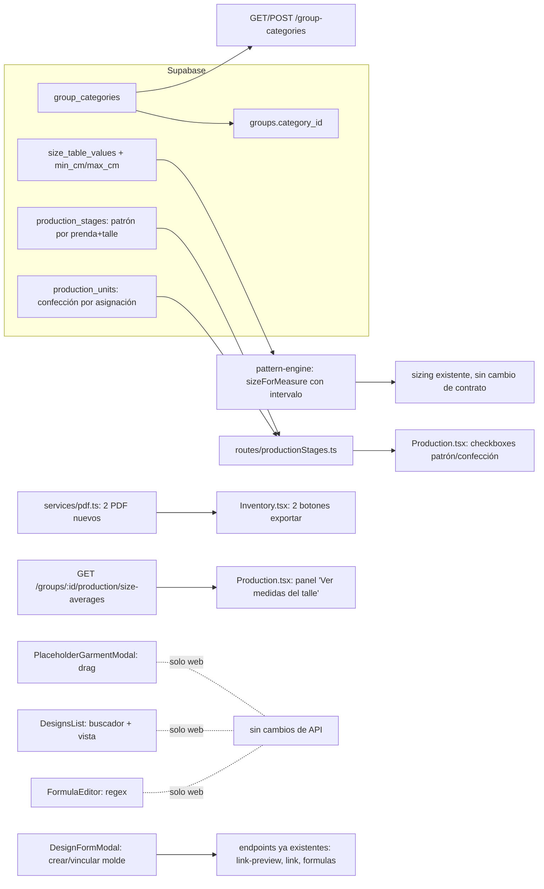

# Diseño — Mejoras de taller 2026

> `requirements.md` aprobado. Este diseño queda aprobado automáticamente por instrucción de la usuaria ("aprobá y aprobá design y task automáticamente").

## Resumen

Ocho mejoras independientes entre sí, agrupadas por dónde tocan el sistema:

- **Datos nuevos, cambios chicos de esquema:** categorías de grupo (Req 1), intervalos en la tabla de talles (Req 8), y dos tablas de progreso de producción (Req 7).
- **Solo web, sin API nueva:** arrastrar medidas (Req 2), buscador y vista de lista en Diseños (Req 4), el bug de decimales (Req 5).
- **Web + API, sin esquema nuevo:** crear/vincular molde desde el diseño (Req 3) — mayormente ya existe, hay que exponerlo en otro lugar.
- **Web + API + PDF:** mano de obra visible, dos PDF nuevos (Req 6), vista de producción por talle con promedio real (Req 8).

Cada uno se implementa y se prueba por separado; ninguno depende de otro salvo Req 8.4–8 (la vista de producción por talle) que reutiliza el intervalo de Req 8.1–3.

## Arquitectura



Capas sin cambios: rutas → servicios → repositorios, sobre de error estándar, RLS por `owner_id`.

## Componentes y responsabilidades

### Req 1 — Categorías de grupo

- **DB** (`supabase/migrations/20260930000000_group_categories_and_archive.sql`): tabla `group_categories` (id, owner_id, name, created_at); `groups` agrega `category_id uuid null references group_categories(id, owner_id) on delete set null` y `archived_at timestamptz null`.
- **API:** `routes/groupCategories.ts` (`GET/POST/PATCH/DELETE /group-categories`); `routes/groups.ts` agrega `categoryId` y `archived` al body de `PATCH /groups/:id`, y `GET /groups?incluir_archivados=1`. `repositories/groups.ts` filtra por `archived_at is null` por defecto y ordena por categoría.
- **Web:** `pages/Home.tsx` agrupa las tarjetas por categoría (encabezado con el nombre, sección "Sin categoría" al final); `components/GroupCategoryModal.tsx` (nuevo, alta/edición); `GroupFormModal` agrega el selector de categoría; `GroupLayout` agrega "Archivar grupo" al menú `ActionMenu` y un filtro "Ver archivados" en Home.

### Req 2 — Arrastrar medidas (`components/designs/PlaceholderGarmentModal.tsx`)

- Se usa **`@dnd-kit/core` + `@dnd-kit/sortable`** (liviana, accesible por teclado de fábrica, ya values="es" no requiere polyfills). Se envuelve la lista `<ol className="hz-chosen">` en `DndContext`/`SortableContext`; cada `<li>` se vuelve `useSortable`. Al soltar, se llama al mismo `move(i, delta)` ya existente recalculado por índice final, así toda la lógica de negocio (orden, `manualOrder`) no cambia. Los botones "Subir"/"Bajar" quedan como están.

### Req 3 — Crear/vincular molde desde la lista de prendas

- Investigado: `DesignFormModal.tsx` ya tiene, por cada prenda `custom`, los botones "Crear molde" (`Link` a `/formulas?mold=`) y "Vincular a molde" (abre `LinkMoldModal`) — **ya cumple el Req 3.1–3.3**. Lo único que falta es el Req 3.4: hoy vincular exitosamente cierra el modal entero (`onLinked` llama `invalidate` + `onClose()`); hay que dejarlo abierto y refrescar solo la fila. Cambio chico: `onLinked` deja de cerrar el formulario, actualiza `customs` local quitando la prenda vinculada (pasa a la lista de prendas con molde) sin cerrar el modal.

### Req 4 — Buscador y vista de lista en Diseños (`pages/designs/DesignsList.tsx`)

- Estado local `query` (filtro por `fold(name)`) y `view: 'grid' | 'list'` persistido en `localStorage` (`hz-designs-view`, con try/catch como el resto de la app). Vista lista: reutiliza `.hz-list`/`.hz-row` (mismo patrón que `GroupDancers`).

### Req 5 — Bug de decimales (`pages/formulas/FormulaEditor.tsx:137`)

- Cambiar `operandIsRef` para que un número **en construcción** (dígitos, con o sin separador final, con o sin dígitos después) no dispare el modo referencia:
  ```ts
  const NUMERIC_WIP = /^\d+([.,]\d*)?$/;      // acepta "3", "3,", "3,14"
  const FRACTION = /^\d+\/\d+$/;
  const operandIsRef = current?.operandB !== undefined && current.operandB !== ''
    && !NUMERIC_WIP.test(current.operandB) && !FRACTION.test(current.operandB);
  ```
  La validación de guardado (`assertValidDefinition` → `validateFormulaSet`, en `pattern-engine`) no cambia: sigue exigiendo que `operandB` sea un número completo o una referencia válida al guardar, así que un "3," a medio escribir sigue sin poder guardarse hasta completarse (Req 5.3).

### Req 6 — Mano de obra visible + dos PDF

- **Web (`Inventory.tsx`):** nueva sección "Mano de obra" con el total separado de "Materiales", y la tabla `perGarment` ya devuelta por `useCosts` (no requiere cambios de API) mostrando `laborCost` por prenda ordenado de mayor a menor (Req 6.1).
- **API — lista de materiales (sin precios):**
  - `services/inventory.ts`: `materialsListPdfData(db, groupId, designId, garmentId?)` reutiliza `groupCosts` pero arma un DTO sin `unitCost` ni `cost`: por prenda, `{ moldName, dancerCount, materials: [{ name, description, unit, perUnit, total, approx }] }`, con `approx = true` cuando el consumo tiene reglas por talle distintas (más de una regla no-nula para ese material).
  - `services/pdf.ts`: `renderMaterialsList(data)`, layout inspirado en `SYNAP 2025.pdf`: encabezado "LISTA DE MATERIALES", una ficha por prenda con grupo + cantidad de bailarinas, cada material con "· cm/mts c/u" y "Total: · mts aprox.", renglón en blanco "Conos de hilo color: ____", renglón "Observaciones: ____". Si `materials` está vacío, un texto "Cargá el consumo de materiales para esta prenda" en su lugar (Req 6.4).
  - `routes/exports.ts`: `GET /groups/:id/materials-list/pdf?design_id=&garment_id=` (Req 6.2, 6.5).
- **API — presupuesto de confección (solo mano de obra):**
  - `services/inventory.ts`: `laborBudgetPdfData(db, groupId, designId)` reutiliza `perGarment` de `groupCosts`, filtrando a `{ moldName, units, laborCostUnit, laborCostTotal }`, sin ningún dato de materiales.
  - `services/pdf.ts`: `renderLaborBudget(data)`, layout propio: "PRESUPUESTO DE CONFECCIÓN", tabla prenda × cantidad × costo unitario × subtotal, total general al pie. Reutiliza `formatMoney`/estilos ya existentes en `pdf.ts` para los PDF con cifras (como el de faltantes).
  - `routes/exports.ts`: `GET /groups/:id/labor-budget/pdf?design_id=`.
- **Web:** dos botones en `Inventory.tsx`, "Lista de materiales" y "Presupuesto de confección", cada uno con su `openPdf`.

### Req 7 — Producción en dos etapas (patrón por talle, confección por unidad)

- **DB:** dos tablas nuevas, ambas con RLS estándar:
  ```sql
  create table public.production_stages (        -- "patrón listo" por prenda + talle + grupo
    id uuid primary key default gen_random_uuid(),
    owner_id uuid not null default auth.uid() references auth.users (id) on delete cascade,
    group_id uuid not null, mold_type_id uuid not null, size_label text not null,
    pattern_done_at timestamptz,
    unique (group_id, mold_type_id, size_label),
    foreign key (group_id, owner_id) references public.groups (id, owner_id) on delete cascade,
    foreign key (mold_type_id, owner_id) references public.mold_types (id, owner_id) on delete cascade
  );
  create table public.production_units (          -- "confección lista" por asignación individual
    id uuid primary key default gen_random_uuid(),
    owner_id uuid not null default auth.uid() references auth.users (id) on delete cascade,
    assignment_id uuid not null,
    sewn_done_at timestamptz not null default now(),
    unique (assignment_id),
    foreign key (assignment_id, owner_id) references public.assignments (id, owner_id) on delete cascade
  );
  ```
  `production_units` guarda una fila **solo cuando está confeccionada** (existe = hecha; se borra al desmarcar), así el conteo "6 de 9" es un simple `count`. `production_stages` guarda una fila por combinación con `pattern_done_at` nulo o no (se podría borrar al desmarcar, pero conservar la fila con fecha nula simplifica el join).
- **API:** `services/production.ts` extiende `groupProduction` para adjuntar, por cada `(moldKey, size)`, `patternDone: boolean` y `sewnCount`/`sewnTotal` (a partir de las `assignments` reales de esa combinación, vía `production_units`). Nuevas rutas en `routes/production.ts`:
  - `PUT /groups/:id/production/pattern` `{ moldTypeId, sizeLabel, done: boolean }`
  - `PUT /assignments/:id/sewn` `{ done: boolean }`
  Ambas devuelven el `groupProduction` recalculado (mismo patrón que `PATCH /assignments/:id/size`).
- **Web (`pages/Production.tsx`):** cada fila de talle muestra un checkbox "Patrón listo" y, al expandir, la lista de bailarinas de ese talle con un checkbox de confección cada una; la cantidad del talle se tacha cuando `sewnCount === sewnTotal`. Resumen por prenda arriba de cada sección (Req 7.6).

### Req 8 — Talles con intervalo + promedio real por talle

- **DB:** `size_table_values` agrega `min_cm numeric(7,2) null`, `max_cm numeric(7,2) null`, con `check (min_cm is null or max_cm is null or min_cm <= max_cm)`; `value_cm` se conserva como el punto medio (se recalcula en la API al guardar un intervalo: `value_cm = round((min+max)/2, 2)`, o se puede seguir editando `value_cm` solo para tablas sin intervalo).
- **Motor puro (`packages/pattern-engine/src/sizing.ts`):** `SizeRow.values` pasa a admitir opcionalmente `ranges: Record<string, { min: number; max: number }>`. `sizeForMeasure` primero busca un talle cuyo rango contenga `value`; si hay más de uno (superposición) o ninguno, cae al criterio actual (más cercano por `ref`/punto medio) — mismo comportamiento hoy para tablas sin rangos. Tests nuevos en `sizing.test.ts` para: valor dentro de un solo rango, superposición, fuera de todos los rangos, tabla sin rangos (regresión).
- **API — promedio real por talle:**
  - `services/production.ts`: `sizeAverages(db, groupId, moldTypeId, sizeLabels[])` — para cada talle pedido, junta las `assignments` del grupo con talle efectivo igual a ese label (mismo cálculo de `sizeView`/`effectiveSize` ya usado en `groupDancersView`), carga sus medidas reales vigentes, y por cada medida que pide el molde calcula el promedio de las bailarinas que la tienen cargada; si ninguna la tiene, usa el intervalo de la tabla de talles activa para ese talle (punto medio) con `source: 'table'` en vez de `'real'`.
  - `routes/production.ts`: `GET /groups/:id/production/size-averages?mold_type_id=&sizes=T2,T4`.
  - Respuesta: `{ sizes: [{ label, tableName, ageRange, measures: [{ key, name, value, source: 'real'|'table', dancerCount }] }] }`.
- **Web:** en `Production.tsx`, botón "Ver medidas del talle" por cada talle (o selección múltiple de talles de una prenda) que abre `components/production/SizeAveragesModal.tsx` con la tabla de medidas, marcando con un ícono los valores que vienen de la tabla en vez de promedio real, y "promedio de N bailarinas" al pie de cada fila con origen `real`.

## Modelos de datos

| Tabla | Cambio |
|---|---|
| `group_categories` | nueva: `id, owner_id, name` |
| `groups` | `+ category_id`, `+ archived_at` |
| `size_table_values` | `+ min_cm`, `+ max_cm` (nullable) |
| `production_stages` | nueva: patrón por `(group_id, mold_type_id, size_label)` |
| `production_units` | nueva: confección por `assignment_id` (existe = hecha) |

Tipos web nuevos: `GroupCategory`, `Production.byGarment[].sizes[].patternDone/sewnCount/sewnTotal`, `SizeAverages`.

## Contratos de API

| Método y ruta | Cuerpo / query | Respuesta |
|---|---|---|
| `GET/POST/PATCH/DELETE /group-categories` | `{ name }` | categoría(s) |
| `PATCH /groups/:id` | `+ categoryId?, archived?` | grupo |
| `GET /groups` | `?incluir_archivados=1` | grupos (excluye archivados por defecto) |
| `PUT /groups/:id/production/pattern` | `{ moldTypeId, sizeLabel, done }` | `Production` |
| `PUT /assignments/:id/sewn` | `{ done }` | `Production` |
| `GET /groups/:id/production/size-averages` | `?mold_type_id=&sizes=` | `SizeAverages` |
| `GET /groups/:id/materials-list/pdf` | `?design_id=&garment_id=` | PDF sin precios |
| `GET /groups/:id/labor-budget/pdf` | `?design_id=` | PDF solo mano de obra |
| `PATCH /size-tables/:id/values` | (igual, admite `minCm`/`maxCm` por celda) | tabla |

## Manejo de errores

| Caso | Respuesta |
|---|---|
| `min_cm > max_cm` al guardar una celda de tabla | 422 `VALIDATION` |
| Marcar confección de una asignación de otra usuaria | 404 estándar (RLS) |
| `PUT .../pattern` con molde/talle que no está en el grupo | 404 `NOT_FOUND` |
| PDF de materiales sin ninguna prenda con consumo | 200 igual, con el texto "Cargá el consumo..." por prenda (no es error) |
| Categoría eliminada con grupos asociados | 200; los grupos quedan con `category_id = null` (no hay bloqueo, `on delete set null`) |

## Estrategia de testing

- **Motor (Vitest):** `sizing.test.ts` — talle por rango, superposición, fuera de rango, tabla sin rangos (regresión de todos los tests existentes).
- **pgTAP:** `group_categories.test.sql` (archivar, `on delete set null`), `production_stages.test.sql` (unicidad por combinación, RLS), `size_table_values` con `min_cm/max_cm` (constraint `min<=max`).
- **API (supertest):** categorías y archivado, patrón/confección (marcar, desmarcar, conteo, recalculo al cambiar asignaciones), promedio real (con y sin datos reales, con talles superpuestos), los dos PDF nuevos (texto esperado, ausencia de precios en el de materiales).
- **Web (Vitest + Testing Library):** arrastrar medidas (simulado con eventos de teclado de `@dnd-kit`, que son accesibles de fábrica), buscador/vista de Diseños, el fix del bug de fórmulas (escribir "3," no cambia el modo), checkboxes de patrón/confección, modal de promedio de talle.
- Regresión: toda la suite existente (pattern-engine, seed-data, API, web) sigue en verde; los tests de `sizeForMeasure`/`suggestSize` actuales no deben romperse.

## Decisiones y trade-offs

- **Confección por fila-existe-o-no** (`production_units`) en vez de un booleano por asignación en la propia tabla `assignments`: evita una migración de columna en una tabla muy usada y mantiene la fecha de cada confección sin agregar ruido a `assignments`.
- **Patrón por combinación, no por asignación:** coincide con el ejemplo de la modista (2 patrones para 10 prendas) y evita duplicar 10 filas de "patrón" cuando es un solo trazado.
- **`@dnd-kit`** en vez de armar el arrastre a mano: ya es accesible por teclado y con lector de pantalla sin trabajo extra, que es un requisito explícito (Req 2.3).
- **Promedio real con respaldo de tabla, no solo tabla:** es lo que pidió la modista; se guarda el origen (`real`/`table`) por medida para que nunca parezca más preciso de lo que es.
- **Dos PDF separados** en vez de uno con casillas de "mostrar precios": más simple de mantener y evita el riesgo de mandarle al proveedor por error una versión con costos.

## Riesgos y mitigaciones

- *Migrar `value_cm` a intervalo sin romper tablas existentes:* `min_cm`/`max_cm` son opcionales; toda tabla actual sigue funcionando exactamente igual hasta que la modista cargue un rango.
- *Promedio real con pocas bailarinas no es representativo:* se muestra siempre "promedio de N bailarinas" para que se note cuando N es chico.
- *Confusión entre los dos PDF nuevos y los que ya existen:* títulos bien diferenciados ("LISTA DE MATERIALES" vs. "PRESUPUESTO DE CONFECCIÓN") y botones con nombres distintos, sin compartir ícono.
- *Categorías y archivado tocan `Home.tsx`, que ya cambiamos hace poco (menos ruido visual):* se agrega la agrupación como una envoltura sobre la grilla existente, sin tocar las tarjetas de grupo en sí.
