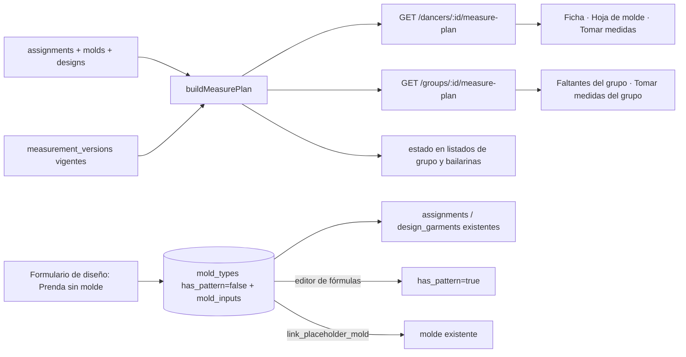

# Diseño — Toma de medidas guiada y prendas sin molde

> Estado: `requirements.md` aprobado por la usuaria. Este diseño quedó aprobado automáticamente por instrucción suya ("aprobá automáticamente el design").
> Los supuestos abiertos de los requerimientos se resuelven como estaban propuestos: orden corporal fijo, vincular es de un solo sentido, y la hoja en blanco para anotar a mano se incluye como parte del PDF de faltantes.

## Resumen

Dos ideas simples sostienen todo el feature:

1. **Una prenda sin molde es un molde "vacío".** En vez de volver opcional `mold_type_id` en `assignments`, `design_garments`, `pattern_sheets`, producción e inventario (una cirugía en decenas de consultas), la prenda propia se guarda como un `mold_types` con `has_pattern = false`, sin fórmulas, cuyas **entradas** (`mold_inputs`, origen "medida") son las medidas que la modista eligió. Asignación, talle sugerido/manual, producción, consumo, costos, PDF y stock funcionan sin tocar su lógica. "Crear molde" es escribir fórmulas sobre ese mismo molde en el editor existente (al guardar fórmulas pasa a `has_pattern = true`). "Vincular a uno existente" reapunta prendas, asignaciones y hojas al molde elegido y elimina el vacío, dentro de una función SQL atómica.
2. **Las medidas requeridas se calculan, no se guardan.** Un cálculo puro (`buildMeasurePlan` en `packages/pattern-engine`) recibe las fuentes de requisitos (moldes/prendas asignadas, medidas especiales de los diseños, o las base "requeridas" si no hay asignaciones) y los valores vigentes, y devuelve la lista ordenada con su estado. La API lo expone por bailarina y por grupo, y reemplaza al estado basado solo en `dancer_measure_status`.

La web suma un flujo a pantalla completa `Tomar medidas` (una medida por paso, guardado inmediato, pensado para el celular), la vista de faltantes del grupo y el alta de "prenda sin molde" en el formulario de diseño.

## Arquitectura



Capas (sin cambios de arquitectura): rutas → servicios → repositorios, sobre de error estándar, RLS por `owner_id`.

## Diseño de UI (entrega 3 de Claude Design)

Referencia visual completa en `design/Hilanzapp Toma de medidas.html` (artefacto exportado; se abre en el navegador; M = móvil, D = escritorio, P = impresión, E = estados). La implementación respeta ese diseño, con estos puntos que salen de él y complementan los requerimientos:

- **Ayuda por medida ("¿Cómo se toma?")**: cada medida base trae un texto corto de cómo tomarla (ej. cadera: "En la parte más ancha de la cola, con los pies juntos."). Se agrega `MEASURE_HELP` en `packages/seed-data` y `GET /measure-definitions` devuelve `help` por `key` (las personalizadas no tienen). Se suma a los Req 2.1.
- **Cola "Tu toma"**: chips con nombre corto (Pecho, Cintura, L. pantalón, Hombro–rodilla…) en estados hecha ✓ / actual / pendiente / saltada, más chips "Extra". Se toca un chip para saltar a esa medida.
- **Flujo**: móvil a pantalla completa con pie fijo (Anterior · Saltar · Siguiente de 56 px; "Guardando…" y "Reintentar" en el mismo botón); escritorio como modal centrado de 480 px sobre la ficha. Enter avanza, Esc cierra, el foco vuelve al campo al cambiar de medida.
- **Toma del grupo**: pantalla intermedia "Emi terminada ✓ · 6 cargadas · 1 saltada · Siguiente: Lucía (4 faltan)" con Seguir / Saltar bailarina / Terminar.
- **Faltantes del grupo**: tarjetas en móvil y tabla en escritorio, con "no la pide" para las medidas que una bailarina no necesita y "—" ámbar tocable; resumen "66 de 84 medidas · 78 %", filtro "Solo con faltantes" e "Imprimir lista".
- **Prenda sin molde**: etiqueta punteada "SIN MOLDE", "Talle según cadera · 4 medidas", menú ⋯ (Editar, Crear molde, Vincular a molde, Quitar), "8 asignadas" por prenda, confirmación de quitar con conteo de asignaciones.
- **Vincular**: lista de moldes con buscador, resumen de impacto ("Pide 2 medidas que Emi todavía no tiene… Otras 3 bailarinas también las necesitan"), casilla "Entiendo que no se puede deshacer".
- **Impresión A4** (blanco y negro): P1 faltantes del grupo con casilleros para anotar, P2 hoja simplificada de prenda sin molde, P3 fila de prenda sin molde en el PDF de producción.
- **Estados** (vacío / cargando / error / éxito) con las frases de taller: "Tomando medidas…", "Buscando la cinta…", "Marcando el molde…", "Contando medidas…", "Hilvanando la prenda…", "Comparando medidas…".

## Componentes y responsabilidades

### Base de datos (`supabase/migrations/20260926000000_measure_plan_and_placeholder_molds.sql`) (Req 1, 8, 11, 12)
- `mold_types.has_pattern boolean not null default true`. Los existentes quedan en `true`.
- `measure_definitions.sort`: **no se migra**; el orden corporal se define en `seed-data` (`measureOrder`) y la API lo aplica por `key` (las personalizadas van después). Descripción original: se rellena con el **orden corporal** (cuello → hombro → espalda → pecho → bajo busto → busto → largos delanteros/traseros → brazo/codo/muñeca/largo de manga → cintura → cadera → muslo/rodilla/pantorrilla/tobillo → largos de pantalón/falda) para las medidas base por `key`; las personalizadas quedan con `sort >= 500`. Las nuevas usuarias lo reciben por la plantilla (`seed-data`).
- Función `public.link_placeholder_mold(p_from uuid, p_to uuid) returns jsonb` (`security invoker`, RLS aplica): valida que `p_from` tenga `has_pattern = false` y `p_to` `true`; falla con `SQLSTATE 'HZ002'` si algún diseño ya tiene una prenda con `p_to`, o `HZ003` si una bailarina ya tiene la asignación destino; reapunta `design_garments`, `assignments` y `pattern_sheets` de `p_from` a `p_to`; borra `p_from`; devuelve conteos. (Req 11.3, 11.5)
- Sin cambios en `assignments`, `design_garments` ni las tablas de inventario.
- pgTAP: `supabase/tests/database/measure_plan.test.sql` (has_pattern por defecto, aislamiento RLS de la función, `HZ002`/`HZ003`, conservación de asignaciones y consumo).

### Motor puro (`packages/pattern-engine/src/measurePlan.ts`) (Req 1, 4, 7)
```ts
buildMeasurePlan({ defs, sources, current }): MeasurePlan
// defs: { id, key, name, sort, isBase, required }[]
// sources: { kind: 'garment' | 'design' | 'base'; label: string; keys: string[] }[]
// current: Record<key, { valueCm: number; takenOn: string }>
// → { items: PlanItem[], total, done, missing, status: 'none'|'partial'|'complete' }
// PlanItem = { definitionId, key, name, sort, requiredBy: {kind,label}[], value: number|null, takenOn: string|null }
```
Une por `key` sin duplicados (acumulando `requiredBy`), ordena por `sort` y luego nombre, y calcula el estado. Sin fuentes distintas de `base` usa las medidas base `required` (Req 1.4, 7.3). Tests con Vitest.

### API (`apps/api/src`)
- `services/measurePlan.ts` (nuevo): `plansForDancers(db, dancerIds)` carga en lote definiciones de medida, asignaciones con `mold_types(name, mold_inputs(key, source, definition_id))`, diseños de cada asignación y de `group_designs` del grupo, `design_special_measures` y medidas vigentes; arma las fuentes y llama al motor. (Req 1, 4)
- `routes/measurePlan.ts` (nuevo, montado en `routes/index.ts`):
  - `GET /dancers/:id/measure-plan`
  - `GET /groups/:id/measure-plan` → matriz bailarinas × medidas
  - `GET /groups/:id/measure-plan/pdf` (Req 6.4; reutiliza `services/pdf.ts` y las fuentes de `assets/fonts`)
- `services/dancers.ts` y `repositories/groups.ts`: el estado `none/partial/complete` y `requiredDone/requiredTotal` pasan a venir del plan (ya no de `dancer_measure_status`). La vista SQL queda como respaldo y para las pruebas de base de datos existentes. (Req 7)
- `routes/measurements.ts`: `GET /measure-definitions` agrega `sort`.
- `services/placeholderMolds.ts` (nuevo): `createPlaceholder(db, ownerId, {name, category, sizePriority, measureDefinitionIds})` (clave `propia_<slug>[_n]`, inserta `mold_types` con `has_pattern=false` y `mold_inputs`), `setRequiredMeasures`, `linkPreview`, `link`.
- `routes/designs.ts`: cada prenda del cuerpo acepta `{ moldTypeId, laborCost }` **o** `{ custom: { name, category, sizePriority, measureIds[] }, laborCost }`; al guardar un diseño, las prendas `custom` sin `moldTypeId` crean su molde vacío y las existentes con `custom` actualizan nombre/categoría/prioridad/medidas del molde vacío (solo si sigue sin patrón). Valida nombre no vacío y único dentro del diseño (422 `DUPLICATE_GARMENT_NAME`). `syncGarments` no cambia. (Req 8)
- `routes/moldEditor.ts`:
  - `PUT /mold-types/:id/formulas`: si el molde queda con ≥ 1 fórmula, `has_pattern = true`.
  - `GET /mold-types/:id/link-preview?target=<uuid>` → `{ newMeasures[], assignments, garments }`.
  - `POST /mold-types/:id/link` `{ targetMoldTypeId }` → llama a `link_placeholder_mold`; mapea `HZ002/HZ003` a 409 `ALREADY_IN_DESIGN` / `ALREADY_ASSIGNED`. (Req 11)
- `services/moldView.ts` y `repositories/molds.ts`: exponen `hasPattern`.
- `services/calculations.ts`: agrega `hasPattern` a la respuesta; si el molde no tiene patrón, valida medidas faltantes como siempre (422 `MISSING_MEASUREMENTS`) y devuelve `rows: []`. (Req 10)
- `services/dancers.ts`, `sizing`, `production`, `inventory`: agregan `hasPattern` a cada prenda para mostrar la etiqueta "Sin molde". (Req 9.4)
- `services/exports.ts`: si el molde no tiene patrón, la hoja PDF es la versión simplificada (bailarina, prenda, talle, medidas requeridas con valores). (Req 10.4)

### Web (`apps/web/src`)
- Rutas nuevas: `/dancers/:dancerId/medir` (flujo, pantalla completa fuera del `AppShell`), `/groups/:groupId/medir` (flujo encadenado) y `/groups/:groupId/faltantes` (vista resumen).
- `lib/takeMeasures.ts` (puro, con tests): `buildQueue(items, { only, extras })`, avanzar/retroceder/saltar, parseo decimal (reutiliza `parseDecimal`). Parámetros de URL: `solo=<claves>`, `volver=<ruta>`, `grupo=<id>`.
- Componentes nuevos: `pages/measures/TakeMeasures.tsx`, `AddMeasuresSheet.tsx` (buscador sin tildes + crear personalizada con `CustomMeasureModal`), `MeasureSummary.tsx`, `pages/measures/GroupMissing.tsx` (matriz, filtro "solo con faltantes", imprimir), `components/designs/PlaceholderGarmentModal.tsx`, `components/molds/LinkMoldModal.tsx`, `components/ui/NoPatternBadge.tsx`.
- Modificados: `MeasuresTab` (tarjeta "Te faltan N", secciones "Requeridas por sus prendas / Para {diseño} / Otras"), `MoldSheet` (botón "Tomar las N que faltan", estado sin molde, acciones crear/vincular), `GroupDancers` (chip "Faltan N", acción rápida, botón "Tomar medidas del grupo"), `DancerFormModal` y `AssignGroupModal` (panel "Para este vestuario vas a necesitar…"), `DesignFormModal` (botón "+ Prenda sin molde", edición de prendas propias), `FormulaEditor` (etiqueta "Sin molde", acceso a vincular), listados de Producción/Inventario/Sidebar del grupo (etiqueta), `lib/queries.ts`, `lib/types.ts`, `styles/app.scss`.

## Modelos de datos

| Entidad | Cambio |
|---|---|
| `mold_types` | `+ has_pattern boolean not null default true` |
| `measure_definitions` | `sort` con orden corporal (datos, sin cambio de esquema) |
| `mold_inputs` | sin cambio; para un molde vacío, una fila por medida requerida (`source='measure'`, `definition_id`, `sort`) |
| `assignments`, `design_garments`, `pattern_sheets`, inventario | sin cambio |

Tipos web nuevos: `MeasurePlan`, `PlanItem`, `GroupPlan`, y `hasPattern` en `Mold`, `Garment`, `Assignment`.

## Contratos de API

| Método y ruta | Cuerpo / query | Respuesta |
|---|---|---|
| `GET /dancers/:id/measure-plan` | — | `{ items: PlanItem[], total, done, missing, status }` |
| `GET /groups/:id/measure-plan` | `?solo_faltantes=1` | `{ measures: {definitionId,key,name}[], dancers: { id, name, missing, status, cells: { definitionId, value \| null }[] }[] }` |
| `GET /groups/:id/measure-plan/pdf` | — | PDF A4 de faltantes con espacio para anotar |
| `POST /designs`, `PATCH /designs/:id` | `garments[]` con `{moldTypeId}` o `{custom:{name,category,sizePriority,measureIds}}` | diseño con prendas (cada una con `hasPattern`) |
| `GET /mold-types/:id/link-preview` | `?target=<uuid>` | `{ newMeasures: {key,name}[], assignments: n, garments: n }` |
| `POST /mold-types/:id/link` | `{ targetMoldTypeId }` | `{ garments, assignments, sheets }` |
| `POST /calculations` | (igual) | agrega `mold.hasPattern`; `rows: []` si no hay patrón |
| `GET /measure-definitions` | — | agrega `sort` |

## Manejo de errores

| Caso | Respuesta |
|---|---|
| Nombre de prenda propia vacío o repetido en el diseño | 422 `VALIDATION` / `DUPLICATE_GARMENT_NAME` |
| Vincular un molde que ya tiene patrón como origen, o uno sin patrón como destino | 422 `NOT_A_PLACEHOLDER` / `TARGET_HAS_NO_PATTERN` |
| Diseño ya tiene una prenda con el molde destino | 409 `ALREADY_IN_DESIGN` |
| Bailarina ya tiene la asignación destino | 409 `ALREADY_ASSIGNED` |
| Recurso de otra usuaria | 404 estándar (RLS) |
| Guardado de medida falla en el flujo | el valor queda en pantalla, aviso con "Reintentar", no avanza |

## Estrategia de testing

- **Motor (Vitest):** `measurePlan.test.ts` — unión sin duplicados, orden corporal, especiales, sin asignaciones → base, estados. `takeMeasures.test.ts` (web) — cola, saltar/volver, extras.
- **pgTAP:** función `link_placeholder_mold`, `has_pattern` por defecto, RLS.
- **API (supertest, Supabase local):** `measurePlan.int.test.ts` (plan por bailarina y grupo, estado según asignaciones, especiales), `placeholderMolds.int.test.ts` (crear prenda propia desde diseño, asignar a grupo, producción/inventario con etiqueta, hoja sin patrón, PDF simplificado, vincular conservando asignaciones/consumo, conflictos 409).
- **Web (Vitest + Testing Library):** flujo Tomar medidas (guardar, error, saltar/volver, repetir, resumen, agregar con búsqueda), MeasuresTab agrupado, MoldSheet (botón de faltantes y estado sin molde), GroupDancers, PlaceholderGarmentModal, LinkMoldModal.
- Regresión: todos los tests existentes deben seguir pasando (las prendas con molde no cambian).

## Decisiones y trade-offs

- **Molde vacío en lugar de `mold_type_id` nulo** (elegida): cero cambios en producción/inventario/asignaciones y migración trivial; costo: los moldes vacíos aparecen en las listas de moldes (se etiquetan "Sin molde") y hay que limpiar el vacío al vincular. Alternativa descartada: prendas sin molde con `mold_type_id` nulo → obliga a reescribir claves compuestas `designId|moldTypeId` en producción, costos, consumo y PDF.
- **Plan calculado en la API en lote** en vez de ampliar la vista SQL `dancer_measure_status`: la vista no puede recorrer moldes y diseños de forma legible; el conjunto de datos por usuaria es chico (cientos de bailarinas), así que 6 consultas por listado alcanzan.
- **Orden fijo por `sort`** (no por molde): consistente entre bailarinas, y la modista mide siempre en la misma secuencia.
- **Flujo como ruta** (no modal): la URL permite volver a la hoja de molde tras medir, encadenar el grupo y recuperar el estado si se recarga.

## Riesgos y mitigaciones

- *Moldes vacíos ensucian la lista de moldes:* etiqueta y orden (los vacíos al final del selector); al vincular se eliminan.
- *Cambio de significado de "medidas completas":* se conserva el mínimo de medidas base cuando no hay asignaciones y se explica en la ficha ("faltan N para sus prendas").
- *Vincular es irreversible:* el modal muestra el impacto y pide confirmación; queda como decisión abierta confirmada con la modista.
- *Teclado del celular tapa el botón "Siguiente":* pie fijo con `env(safe-area-inset-bottom)` y `visualViewport`; se verifica a 360 px.
- *Rendimiento del listado de grupos:* una sola carga en lote por request; si crece, se cachea por usuaria.
